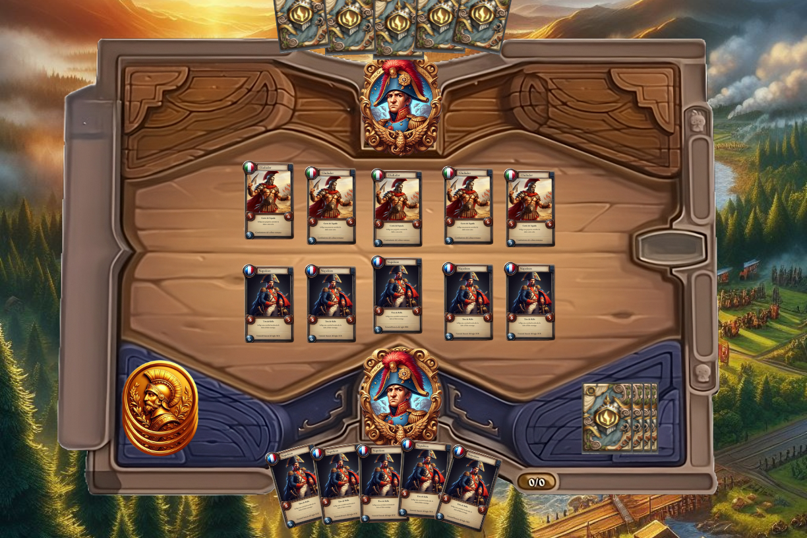

# **Time Clash Chronicles**

## _Game Design Document_

---

##### Diego Abdo A01783808

##### Andres Gomes A01781321

##### Isaac Shakalo A01784045

##

## _Índice_

---

1. [Indíce](#index)
2. [Diseño del Juego](#diseño-del-juego)
   1. [Resumen](#resumen)
   2. [Gameplay](#gameplay)
   3. [Mindset](#mindset)
3. [Técnico](#técnico)
   1. [Pantallas](#pantallas)
   2. [Controles](#controles)
   3. [Mecánicas](#mecánicas)
4. [Diseño de Nivel](#diseño-de-nivel)
   1. [Arenas](#arenas)
   2. [Flujo de Juego](#flujo-de-juego)
5. [Desarrollo](#desarrollo)
   1. [Clases Abstractas](#clases-abstractas)
   2. [Clases Derivadas](#clases-derivadas)
6. [Gráficos](#gráficos)
   1. [Atributos de Estilo](#atributos-de-estilo)
   2. [Graphicos Necesitados](#gráficos-necesitados)
7. [Sonidos/Música](#sonidosmúsica)
   1. [Atributos de Estilo](#atributos-de-estilo-1)
   2. [Sonidos Requeridos](#sonidos-requeridos)
   3. [Música](#música)

## _Diseño del Juego_

---

### **Resumen**

Un juego de cartas donde personajes históricos batallan en una arena, siendo cada mazo representativo de un país, compuesto por los personajes más importantes de cada nación. Distintas naciones, tienen distintas fortalezas y debilidades, así como efectos especiales únicos de ese país y un líder representativo del mismo.

El objetivo del juego es bajar la vida del líder enemigo a 0 puntos de vida. Para conseguir este objetivo es necesario derrotar a su ejército, representado por el mazo. Cada carta cuenta con puntos de vida, ataque y costo, las cuales se enfrentan directamente para poder alcanzar al líder enemigo. Este juego tiene inspiración directa en juegos como Yu-gi-Oh y Pokemon TCG, tiene elementos de juegos de estrategia, TCG y Turn based combat.

### **Gameplay**

Cada jugador podrá elegir uno de los mazos disponibles al iniciar el juego, los cuales se encuentran ya prearmados dependiendo de su país. Una vez en la arena de juego se decide aleatoriamente que jugador inicia. Cada jugador empieza con tres cartas de su mazo que se dan de manera aleatoria y una cierta cantidad de monedas de oro. Al inicio de cada turno cada jugador toma una carta de su mazo y recibe 3 monedas de oro. Cada líder empieza con 20 puntos de vida.

Cada carta tiene sus puntos de vida, ataque y costo, con esto el jugador puede decidir qué hacer en ese turno. El jugador puede invocar hasta 5 cartas según la cantidad de oro que tenga, las cartas invocadas solo pueden atacar hasta un turno después de ser invocada, a menos de que tengan un efecto que se los permita. Se puede atacar tanto a las cartas enemigas como al líder enemigo, sin embargo, no puedes atacar directamente al líder si existe al menos 1 carta enemiga en el campo.

Cuando una carta recibe un daño mayor o igual a los puntos de vida, es destruida y la diferencia entre el daño y la vida de la carta se le resta al líder enemigo. Una vez que los puntos de vida del líder enemigo llegan a 0, la partida termina y el jugador gana. Sin embargo, si el jugador pierde todos sus puntos de vida, es derrotado.

### **Mindset**

El juego será centrado en estrategia y marcado por lo visual y musical, el jugador debe adoptar un mindset de enfoque constante. La presión para tomar decisiones óptimas en cada turno es elevada, requiriendo concentración y análisis rápido.. La música y lo visual no solo añaden emoción, sino que también sirven como señales clave para anticipar momentos críticos. Este mindset permite al jugador sumergirse en la complejidad del juego y disfrutar plenamente de la experiencia.

## _Técnico_

---

### **Pantallas**

1. Menú de Inicio
   1. Dentro del menú de inicio se va a mostrar el logo y nombre del juego, habrá dos botones uno de Login y otro de Registrarse.
2. Selección de Baraja
   1. Al seleccionar la baraja la baraja elegida tendrá un efecto de resaltado para indicar que esa baraja está seleccionada y dará una descripción de qué es lo que hace la baraja.
3. Detalles de Baraja
   1. Dentro de la baraja se podrán ver todas las cartas que esta contiene con sus detalles.
4. Arena de Juego
   1. En la arena de juego, cada jugador dispondrá de cinco posiciones, con una división en el centro. El jugador sostendrá en su mano tres cartas del deck, mientras que las restantes cartas del deck se ubicarán a la derecha de su mano. En la parte posterior de la arena, se situará el líder principal del país, y frente a él se desplegarán las oposiciones de las barajas que el jugador puede emplear.
5. Estadísticas
   1. En esta pantalla el jugador podrá ver estadísticas como su número de victorias y derrotas, número de juegos, etc.

### **Controles**

El juego se manejará con el mouse para poder hacer click en los botones necesarios.

### **Mecánicas**

#### 1. Selección de mazo:

- Cada jugador elige uno de los mazos prearmados disponibles, que están vinculados a un país.

#### 2. Juego:

- Se decide aleatoriamente qué jugador inicia.
- Cada jugador comienza con tres cartas aleatorias de su mazo y el jugador que empieza con cuatro.
- Cada jugador recibe una cierta cantidad de monedas de oro al inicio.
- Cada líder comienza con 20 puntos de vida.

#### 3. Invocación de Cartas:

- Al inicio de cada turno, cada jugador toma una carta de su mazo y recibe 3 monedas de oro.
- Existen 5 espacios en la arena del lado del jugador.
- Los jugadores pueden invocar hasta 5 cartas, ya que solo existen 5 espacios para invocación.
- Las cartas invocadas solo pueden atacar a partir del siguiente turno, a menos que tengan un efecto que lo permita.

#### 4. Ataques:

- Los jugadores pueden atacar tanto a las cartas enemigas como al líder enemigo.
- El jugador selecciona la carta y elige a qué carta quiere atacar. La selección del ataque es manual.
- No se puede atacar al líder si hay una carta enemiga directamente en frente de la carta almenos que haya una habilidad.
- Cuando una carta recibe un daño igual o mayor a sus puntos de vida, se destruye.
- La diferencia entre el daño y la vida de la carta se resta de los puntos de vida del líder enemigo.
- La partida termina cuando los puntos de vida del líder enemigo llegan a 0, y el jugador gana.

#### 5. Habilidades:

- Existen las habilidades, dependiendo el mazo escojido, tendra diferentes habilidades dentro del juego en las que se podran ser activadas al presionar el boton de la izquierda del tablero.

#### 6. Efectos:

(Italia)
1, Curar, Al ser invocada le sube la vida a las cartas de su pais que estan en la arena.

- Diocles(+3 al usar habilidad)
- Gladiador(+1 al usar habilidad)

(Francia)
2, Incrementa Daño, Daño, Al ser invocada le sube los puntos de ataque a las cartas de su pais que estan en la arena.

- Juana de Arco (+3 puntos de ataque )

(Japon)
3, Reducir Daño, Al ser invocada hace daño a todas las cartas enemigas restandoles puntos de vida.

- Sasaki Kojiro (-3 punto vida al oponente con habilidad)
- Samurai(-1 punto vida al oponente con habilidad )

(Mexico)
4, Robar Vida, Al ser invocada se roba vida de el enemigo y se suma a la vida de tus cartas en la arena.

- Moctezuma (+2 puntos de vida con habilidad)
- Shaman (+1 punto de vida con habilidad )

(Estados Unidos)
5, Atacar Lider, Al ser invocada Las cartas en la arena atacan directamente a el lider.

- atacar directo al lider con habilidad

### **Arena**

1. Arena de Juego

1. Una arena legendaria y futuristica llena de emocion y ambicion por ganar y darle honor a tu pais.

### Cartas

**Referencia:** Ataque/Vida/Costo

**Ejemplo:** Carta Dummy - 1ATK/3HP/3G (Ataque/Vida/Costo)

**Naciones**

#### Francia

Líder: Napoleón

- Soldado de la Segunda Guerra Mundial
- Caballero Francés
- Juana de Arco (+3 puntos de ataque )
- Revolucionario Francés
- Cura
- Victor Hugo
- María Antonieta

#### Estados Unidos

- Líder: George Washington
- Soldado de la Independencia
- Abraham Lincoln
- Marine
- John D. Rockefeller (atacar directo al lider con habilidad)
- Henry Ford
- Benjamin Franklin
- Médico de la Guerra Civil

#### México

- Líder: Emiliano Zapata
- Soldado Revolucionario
- Charro
- Guerrero Azteca
- Moctezuma (+2 puntos de vida con habilidad)
- Quetzalcóat
- Benito Juarez
- Shaman (+1 punto de vida con habilidad )

#### Japón

- Líder: Oda Nobuna

- Samurai(-1 punto vida al oponente con habilidad )
- Ninja
- Sakamoto Ryoma
- Soldado Imperial
- Geisha:
- Miyamoto Musashi
- Sasaki Kojiro (-3 punto vida al oponente con habilidad)

#### Italia

- Líder: Julio César

- Legionario
- Centurión
- Diocles(+3 al usar habilidad)
- Gladiador(+1 al usar habilidad)
- Antiguos cristianos
- Leonardo Da Vinci
- Flamma

### **Flujo de Juego**

1. Inicio de la Partida:

   - Se elige al azar un jugador para iniciar la partida.
   - Cada jugador comienza sin monedas, con 20 puntos de vida y 3 cartas en mano.

2. Turno del Jugador:

   - Al iniciar el turno, el jugador recibe 3 monedas de oro y toma una carta del mazo.
   - El jugador decide si invocar una o varias cartas según su cantidad de oro y el costo de las cartas.
   - Las cartas invocadas pueden usar habilidades si están disponibles.
   - Si ha pasado un turno desde que se invocó una carta, esta puede atacar una vez por turno.

3. Ataques:

   - Las cartas solo pueden atacar a las cartas enemigas, no al líder, a menos que no haya cartas enemigas invocadas.
   - Al destruir una carta enemiga, la diferencia entre el ataque y los puntos de vida de la carta se resta de los puntos de vida del jugador contrario.
   - Si no hay cartas enemigas invocadas, se puede atacar directamente al líder enemigo para reducir sus puntos de vida.
   - Las habilidades solo pueden usarse si la carta no ha atacado en el mismo turno.

4. Fin del Turno:

   - Una vez que el jugador haya invocado sus cartas y no tenga más acciones por realizar, termina su turno.
   - Existe un botón para terminar el turno en cualquier momento, incluso si el jugador aún puede realizar acciones.

5. Fin del Juego:
   - El juego termina cuando los puntos de vida de uno de los jugadores llegan a 0, o si un jugador se rinde o desconecta de la partida.

## _Gráficos_

---

### **Atributos de Estilo**

Nuestro juego tendrá un estilo realista y detallado similar a Age of Empires 2. Esto incluye arquitectura, paisajes y muchos personajes históricos. Vamos a usar bordes sólidos y definidos para destacar diferentes elementos. Usaremos efectos como cambios de color y sombras para darle feedback al jugador sobre sus acciones.

### **Gráficos Necesarios**

1. Personajes con apariencia humana.
2. Carta y plantilla con estados
3. Animación de color es decir cuando esta perdiendo o ganando vida (para cartas)
4. Vida (disminuyendo o aumentando)
5. Fondos arena
6. Imágenes de cada líder
7. Foto del menú principal

#### Cartas

#### Líder de Nación

#### Menu de Inicio

#### Arenas

#### Tablero

## _Sonido/Música_

### **Atributos de Estilo**

La música refleja la atmósfera épica e histórica del juego. Se usarán instrumentos que crean sonidos antiguos y de guerra como tambores, cuernos, y flautas. Para los efectos sonidos se usarán sonidos realistas como choques de espadas para los ataques, flechas, y caballos galopando. La música tomará algo de influencia de las distintas culturas de las naciones del juego.

### **Sonidos Requeridos**

1. Sonidos

   3. Entrada a la arena de juego
   4. Recibir monedas (saco de monedas)
   5. Invocación de carta (grito del líder)
   6. Ataque (sonido de espada)
   7. Carta muere (espadas chocan)
   8. Juego terminado (trompetas)
   9. Música de fondo (strategic song)

2. Música
   1. [https://www.youtube.com/watch?v=ENyxseq59YQ](https://www.youtube.com/watch?v=ENyxseq59YQ)
   2. [https://www.youtube.com/watch?v=PkOC5BnnXwU&list=PL1800E1EFCA1EABE3&index=9](https://www.youtube.com/watch?v=PkOC5BnnXwU&list=PL1800E1EFCA1EABE3&index=9)
   3. [https://www.youtube.com/watch?v=r30D3SW4OVw](https://www.youtube.com/watch?v=r30D3SW4OVw)
   4. [https://www.youtube.com/watch?v=NPX6_qfUIhw](https://www.youtube.com/watch?v=NPX6_qfUIhw)
   5. [https://www.youtube.com/watch?v=IBp0Pu3NeOo&list=PLamnoxId_aK2qxsln0OiDh9s3Pa1vgfvb](https://www.youtube.com/watch?v=IBp0Pu3NeOo&list=PLamnoxId_aK2qxsln0OiDh9s3Pa1vgfvb)
   6. [https://www.youtube.com/watch?v=z0qSFnNxcdc&list=PL5149F2CAD2F42910&index=1](https://www.youtube.com/watch?v=z0qSFnNxcdc&list=PL5149F2CAD2F42910&index=1)
