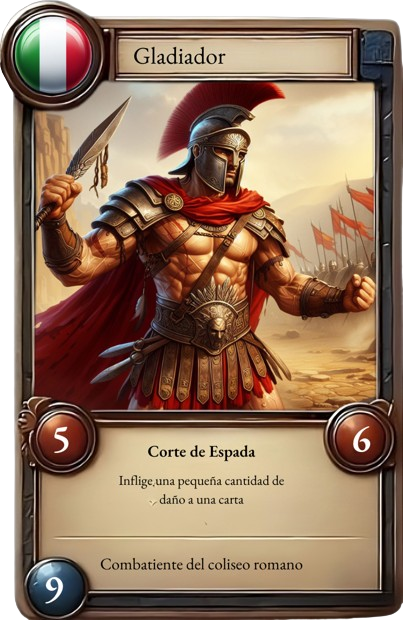

# **Time Clash Chronicles**

## _Game Design Document_

---

##### Diego Abdo A01783808

##### Andres Gomes A01781321

##### Isaac Shakalo A01784045

##

## _Índice_

---

1. [Indíce](#index)
2. [Diseño del Juego](#diseño-del-juego)
   1. [Resumen](#resumen)
   2. [Gameplay](#gameplay)
   3. [Mindset](#mindset)
3. [Técnico](#técnico)
   1. [Pantallas](#pantallas)
   2. [Controles](#controles)
   3. [Mecánicas](#mecánicas)
4. [Diseño de Nivel](#diseño-de-nivel)
   1. [Arenas](#arenas)
   2. [Flujo de Juego](#flujo-de-juego)
5. [Desarrollo](#desarrollo)
   1. [Clases Abstractas](#clases-abstractas)
   2. [Clases Derivadas](#clases-derivadas)
6. [Gráficos](#gráficos)
   1. [Atributos de Estilo](#atributos-de-estilo)
   2. [Graphicos Necesitados](#gráficos-necesitados)
7. [Sonidos/Música](#sonidosmúsica)
   1. [Atributos de Estilo](#atributos-de-estilo-1)
   2. [Sonidos Requeridos](#sonidos-requeridos)
   3. [Música](#música)

## _Diseño del Juego_

---

### **Resumen**

Un juego de cartas donde personajes históricos batallan en una arena, siendo cada mazo representativo de un país, compuesto por los personajes más importantes de cada nación. Distintas naciones, tienen distintas fortalezas y debilidades, así como efectos especiales únicos de ese país y un líder representativo del mismo.

El objetivo del juego es bajar la vida del líder enemigo a 0 puntos de vida. Para conseguir este objetivo es necesario derrotar a su ejército, representado por el mazo. Cada carta cuenta con puntos de vida, ataque y costo, las cuales se enfrentan directamente para poder alcanzar al líder enemigo. Este juego tiene inspiración directa en juegos como Yu-gi-Oh y Pokemon TCG, tiene elementos de juegos de estrategia, TCG y Turn based combat.

### **Gameplay**

Cada jugador podrá elegir uno de los mazos disponibles al iniciar el juego, los cuales se encuentran ya prearmados dependiendo de su país. Una vez en la arena de juego se decide aleatoriamente que jugador inicia. Cada jugador empieza con tres cartas de su mazo que se dan de manera aleatoria y una cierta cantidad de monedas de oro. Al inicio de cada turno cada jugador toma una carta de su mazo y recibe 3 monedas de oro. Cada líder empieza con 4000 puntos de vida.

Cada carta tiene sus puntos de vida, ataque y costo, con esto el jugador puede decidir qué hacer en ese turno. El jugador puede invocar hasta 3 tres cartas según la cantidad de oro que tenga, las cartas invocadas solo pueden atacar hasta un turno después de ser invocada, a menos de que tengan un efecto que se los permita. Se puede atacar tanto a las cartas enemigas como al líder enemigo, sin embargo, no puedes atacar directamente al líder si existe al menos 1 carta enemiga en el campo.

Cuando una carta recibe un daño mayor o igual a los puntos de vida, es destruida y la diferencia entre el daño y la vida de la carta se le resta al líder enemigo. Una vez que los puntos de vida del líder enemigo llegan a 0, la partida termina y el jugador gana. Sin embargo, si el jugador pierde todos sus puntos de vida, es derrotado.

### **Mindset**

El juego será centrado en estrategia y marcado por lo visual y musical, el jugador debe adoptar un mindset de enfoque constante. La presión para tomar decisiones óptimas en cada turno es elevada, requiriendo concentración y análisis rápido.. La música y lo visual no solo añaden emoción, sino que también sirven como señales clave para anticipar momentos críticos. Este mindset permite al jugador sumergirse en la complejidad del juego y disfrutar plenamente de la experiencia.

## _Técnico_

---

### **Pantallas**

1. Menú de Inicio
   1. Dentro del menú de inicio se va a mostrar el logo y nombre del juego, habrá dos botones uno de iniciar el juego y otro de salir del juego.
   2. Al presionar inicio de juego tendrás que llenar tu nombre.
   3. Al presionar salir del juego se terminara el juego y saldras de el juego.
2. Selección de Baraja
   1. Al seleccionar la baraja la baraja elegida tendrá un efecto de resaltado para indicar que esa baraja está seleccionada y dará una descripción de qué es lo que hace la baraja.
3. Detalles de Baraja
   1. Dentro de la baraja se podrán ver todas las cartas que esta contiene con sus detalles.
4. Arena de Juego
   1. En la arena de juego, cada jugador dispondrá de tres posiciones, con una división en el centro. El jugador sostendrá en su mano tres cartas del deck, mientras que las restantes cartas del deck se ubicarán a la derecha de su mano. En la parte posterior de la arena, se situará el líder principal del país, y frente a él se desplegarán las oposiciones de las barajas que el jugador puede emplear.
5. Estadísticas
   1. En esta pantalla el jugador podrá ver estadísticas como su número de victorias y derrotas, número de juegos, etc.

### **Controles**

El juego se manejará con el mouse para poder hacer click en los botones necesarios.

### **Mecánicas**

#### 1. Selección de mazo:

- Cada jugador elige uno de los mazos prearmados disponibles, que están vinculados a un país.

#### 2. Juego:

- Se decide aleatoriamente qué jugador inicia.
- Cada jugador comienza con tres cartas aleatorias de su mazo.
- Cada jugador recibe una cierta cantidad de monedas de oro al inicio.
- Cada líder comienza con 40 puntos de vida.

#### 3. Invocación de Cartas:

- Al inicio de cada turno, cada jugador toma una carta de su mazo y recibe 3 monedas de oro.
- Existen 5 espacios en la arena del lado del jugador.
- Los jugadores pueden invocar hasta 5 cartas, ya que solo existen 5 espacios para invocación.
- Las cartas invocadas solo pueden atacar a partir del siguiente turno, a menos que tengan un efecto que lo permita.

#### 4. Ataques:

- Los jugadores pueden atacar tanto a las cartas enemigas como al líder enemigo.
- El jugador selecciona la carta y elige a qué carta quiere atacar. La selección del ataque es manual.
- No se puede atacar al líder si hay una carta enemiga directamente en frente de la carta.
- Cuando una carta recibe un daño igual o mayor a sus puntos de vida, se destruye.
- La diferencia entre el daño y la vida de la carta se resta de los puntos de vida del líder enemigo.
- La partida termina cuando los puntos de vida del líder enemigo llegan a 0, y el jugador gana.

#### 5. Habilidades:

- Existen 2 tipos de habilidades, habilidades pasivas y habilidades activas.
- Las habilidades pasivas no requieren activación, por lo cual siempre están activas mientras la carta que posea esta habilidad se encuentre invocada en el campo.
- Las habilidades activas requieren de una activación para poder ser utilizadas.
- Los efectos activos tienen un costo de oro, por lo cual el jugador deberá de usar sus monedas de oro para poder activarlas.

#### 6. Efectos:

- Ataques que infligen daño a cartas enemigas.
- Habilidades que reducen oro al oponente.
- Habilidades que le roban oro al oponente.
- Habilidades de curación.
- Habilidades de aumento de generación de oro por turno.
- Habilidades que reducen daño a cartas enemigas.

## _Diseño de Nivel_

---

### **Arenas**

1. Bosque de las Ardenas (Francia)

   1. Terreno con bosques y colinas.
   2. Efecto de niebla en la arena.
   3. Ambiente misterioso y oscuro.

2. Gran Cañón (Estados Unidos)

   1. Terreno desértico con acantilados.
   2. Vista lejana.
   3. Cambios de elevación.

3. Pirámides de Teotihuacán (México)

   1. Terreno de jungla.
   2. Estructuras y arquitectura.

4. Coliseo Romano (Italia)

   1. Arena circular.
   2. Arquitectura romana.

5. Monte Fuji (Japón)
   1. Terreno Montañoso.
   2. Ambiente nevado.

### Cartas

**Referencia:** Ataque/Vida/Costo

**Ejemplo:** Carta Dummy - 1ATK/3HP/3G (Ataque/Vida/Costo)

**Naciones**

#### Francia

- **Líder: Napoleón**
  - Habilidad Líder: Embargo: Se reduce a la mitad el oro del oponente. Mínimo de reducción 2 (Ej. si el oponente tiene 2 de oro, se le reduce en 2 a 0). Costo 5G, Cooldown 3 turnos
- **Soldado de la Segunda Guerra Mundial:** 2ATK/2HP/2G
  - Ataque Básico: Tiro de Rifle - Hace una cantidad de daño a una carta enemiga.
- **Caballero Francés:** 4ATK/4HP/4G
  - Ataque Básico: Corte de Espada - Hace una cantidad de daño a una carta enemiga.
- **Juana de Arco:** 8ATK/5HP/7G
  - Habilidad especial: Providencia (Pasiva) - Al atacar directamente al líder contrario, se roba 1 moneda de oro.
  - Ataque Básico: Espada Divina - Inflige daño a una carta enemiga.
- **Revolucionario Francés:** 2ATK/1HP/1G
  - Ataque Básico: Grito de Libertad - Inflige daño a una carta enemiga.
- **Cura:** 1ATK/4HP/2G
  - Habilidad Especial: Agua bendita (Activa) - Cura 2 puntos de vida de una carta seleccionada. Costo: 2G
- **Victor Hugo:** 2ATK/3HP/4G
  - Habilidad especial: Inspiración Literaria (Activa) - Una de tus cartas francesa obtiene un bonus de 3 a su ataque y puntos de vida. Este efecto dura 3 turnos. Costo: 3G
- **María Antonieta:** 2ATK/5HP/3G
  - Habilidad especial: ¡Coman pastel! (Activa) - Selecciona una carta enemiga para evitar que ataque por un turno.

#### Estados Unidos

- **Líder: George Washington**
  - Habilidad de Líder: Impuestos: Obtiene 1 moneda de oro por cada carta invocada en el campo de batalla, incluyendo cartas enemigas. Costo 2G, Cooldown de 4 turnos
- **Soldado de la Independencia:** 3ATK/3HP/3G
  - Ataque Básico: Disparo de Mosquete - Inflige daño a una carta enemiga.
- **Abraham Lincoln:** 3ATK/4HP/5G
  - Habilidad Especial: Emancipación (Activa) - Reduce 3 puntos de ataque de una carta enemiga durante un turno.
  - Ataque Básico: Discurso - Inflige daño a una carta enemiga.
- **Marine:** 4ATK/4HP/4G
  - Ataque Básico: Ráfaga - Inflige daño a una carta enemiga.
- **John D. Rockefeller:** 6ATK/9HP/9G
  - Habilidad Especial: Riqueza abrumadora (Pasiva) - Rockefeller gana 1 de daño por cada 2 monedas de oro que posea el jugador. Máximo hasta 5 de daño.
  - Ataque Básico: Martillo de Oro - inflige daño a una carta enemiga
- **Henry Ford:** 3ATK/6HP/6G
  - Habilidad Especial: Línea de Ensamblaje (Pasiva) - Genera 2 de oro adicional por cada turno que esté Henry invocado en el campo.
  - Ataque Básico: Golpe de llave - inflige daño a una carta enemiga
- **Benjamin Franklin:** 4ATK/5HP/5G
  - Habilidad Especial: Corte eléctrico (Activa) - Benjamin franklin causa una explosión eléctrica que le hace un daño de 2 a todas las cartas enemigas. Costo 3G.
  - Ataque Básico: Relámpago - Inflige daño a una carta enemiga.
- **Médico de la Guerra Civil:** 2ATK/3HP/3G
  - Habilidad Especial: Rescate (Activa) - Selecciona una carta aliada para restaurar 3 puntos de vida. Costo 3G
  - Ataque Básico: Bisturí - Inflige daño a una carta enemiga.

#### México

- **Líder: Emiliano Zapata**
  - Habilidad líder: Revolución: Todas las cartas aliadas en el campo adquieren un ataque adicional. Costo 4G, Cooldown de 3 turnos
- **Soldado Revolucionario:** 2ATK/2HP/2G
  - Ataque Básico: Disparo de Pistola - Inflige daño a una carta enemiga
- **Charro:** 3ATK/1HP/2G
  - Ataque Básico: Lazo Vaquero - Inflige daño a una carta enemiga
- **Guerrero Azteca:** 5ATK/4HP/4G
  - Ataque Básico: Golpe de Macuahuitl - Inflige daño a una carta enemiga
- **Moctezuma:** 6ATK/5HP/6G
  - Habilidad especial (Pasiva): Fuerza del Imperio - Aumenta el poder de ataque de las cartas en el campo en 2 puntos mientras Moctezuma este invocado en el campo.
  - Ataque Básico: Lanza Azteca - Inflige daño a una carta enemiga
- **Quetzalcóatl:** 7ATK/7HP/7G
  - Habilidad Especial: Viento Divino (Pasiva): Cada vez que Quetzalcóatl ataque, se le añade un contador. Por cada contador, Quetzalcóatl obtiene 1 de daño. Máximo de 6
  - Ataque Básico: Serpiente Emplumada - Inflige daño a una carta enemiga
- **Benito Juarez:** 5ATK/5HP/5G
  - Habilidad Especial: Grito revolucionario (Activa): Permite que una carta aliada ataque dos veces en un turno. Costo 3G
  - Ataque Básico: Golpe independentista - Inflige daño a una carta enemiga
- **Shaman:** 2ATK/3HP/3G
  - Habilidad Especial: Medicina Ancestral (Activa): Cura una carta aliada por 3 puntos. Costo 1G
  - Ataque Básico: Arco y Flecha - Inflige daño a una carta enemiga

#### Japón

- **Líder: Oda Nobuna**
  - Habilidad Líder: El Rey Demonio: Todas las cartas adquieren un robo de vida de 1 punto de vida por cada 2 puntos de ataque. Máximo de 5 puntos de vida. Costo 3G Cooldown de 2 turnos
- **Samurai:** 4ATK/2HP/3G
  - Ataque Básico: Corte de Katana - Inflige daño a una carta enemiga.
- **Ninja:** 2ATK/2HP/2G
  - Ataque Básico: Shuriken - Inflige daño a una carta enemiga.
- **Sakamoto Ryoma:** 5ATK/4HP/5G
  - Habilidad especial: Fuerza Rebelde (Activa): le otorga robo de vida de 2 puntos a una carta por los próximos 3 turnos. Costo 3G
  - Ataque Básico: Espada Divina - Inflige daño a una carta enemiga.
- **Soldado Imperial:** 5 ATK/3HP/4G
  - Ataque Básico: Disparo de rifle- Inflige daño a una carta enemiga.
- **Geisha:** 3ATK/1HP/2G
  - Ataque Básico: Abanico - Inflige daño a una carta enemiga.
  - Habilidad Especial: Masaje (Activa) - Cura 2 puntos de vida de una carta seleccionada. Costo 2G
- **Miyamoto Musashi:** 6ATK/8HP/7G
  - Habilidad especial: Camino Samurai (Pasiva) - Cada vez que Musashi destruye una carta enemiga, aumenta su daño en 1. Máximo de 5 de daño.
  - Ataque Básico: Katana Doble- Inflige daño moderado a una carta enemiga.
- **Sasaki Kojiro:** 5ATK/9HP/7G
  - Habilidad especial: Camino del Perdedor (Pasiva) - Cada vez que es atacado, Sasaki gana 2 puntos de ataque. Máximo de 6.
  - Ataque Básico: Corte del agua - Inflige daño moderado a una carta enemiga.

#### Italia

- **Líder: Julio César**
  - Habilidad Líder: Testudinum Formate: Todas las cartas aliadas adquieren 3 puntos de vida. Estos son añadidos al máximo de HP de la carta. Si la carta ha sufrido daño, se curarán 3HP y se le aumentará el máximo de vida, mas no se le curará al máximo. Costo 4G cooldown 4 turnos
- **Legionario:** 1ATK/3HP/2G
  - Ataque Básico: Ataque de Lanza - Inflige daño a una carta enemiga.
- **Centurión:** 2ATK/4HP/3G
  - Ataque Básico: Espadazo Romano - Inflige daño a una carta enemiga.
- **Diocles:** 6ATK/8HP/7G
  - Habilidad especial: Carrera Mortal (Pasiva)- Si una carta ataca a Diocles, recibe 2 puntos de daño .
  - Ataque Básico: Atropellamiento - Inflige daño a una carta enemiga.
- **Gladiador:** 3ATK/5HP/ 4G
  - Ataque Básico: Hacha fulminante - Inflige daño a una carta enemiga.
- **Antiguos cristianos:** 1ATK/4HP/3G
  - Ataque Básico: Golpe de cruz - Inflige daño a una carta enemiga.
  - Habilidad Especial: Fé (Activa) - Cura 3 puntos de vida de una carta seleccionada. Costo 2G
- **Leonardo Da Vinci:** 3ATK/6HP/5G
  - Habilidad especial: Renacimiento (Pasiva) - Todas las cartas aliadas adquieren 2 punto de vida extra mientras Leonardo esté en el campo. Condiciones aplican igual que la habilidad de líder.
  - Ataque Básico: Pincelazo - Inflige daño moderado a una carta enemiga.
- **Flamma:** 7ATK/5HP/6G
  - Habilidad especial: Orgullo (Pasiva) - Flamma gana 1 punto de vida por cada carta enemiga destruida. Máximo 5 puntos de vida
  - Ataque Básico: Corte Gladius - Inflige daño moderado a una carta enemiga.

### **Flujo de Juego**

1. Inicio de la Partida:

   - Se elige al azar un jugador para iniciar la partida.
   - Cada jugador comienza sin monedas, con 40 puntos de vida y 3 cartas en mano.

2. Turno del Jugador:

   - Al iniciar el turno, el jugador recibe 3 monedas de oro y toma una carta del mazo.
   - El jugador decide si invocar una o varias cartas según su cantidad de oro y el costo de las cartas.
   - Las cartas invocadas no pueden atacar en el mismo turno, pero pueden usar habilidades si están disponibles.
   - Si ha pasado un turno desde que se invocó una carta, esta puede atacar una vez por turno.

3. Ataques:

   - Las cartas solo pueden atacar a las cartas enemigas, no al líder, a menos que no haya cartas enemigas invocadas.
   - Al destruir una carta enemiga, la diferencia entre el ataque y los puntos de vida de la carta se resta de los puntos de vida del jugador contrario.
   - Si no hay cartas enemigas invocadas, se puede atacar directamente al líder enemigo para reducir sus puntos de vida.
   - Las habilidades solo pueden usarse si la carta no ha atacado en el mismo turno.

4. Habilidades del Líder:

   - El jugador puede usar la habilidad especial de su líder en cualquier momento del turno.
   - Estas habilidades son costosas y tienen un cooldown.

5. Fin del Turno:

   - Una vez que el jugador haya invocado sus cartas y no tenga más acciones por realizar, termina su turno.
   - Existe un botón para terminar el turno en cualquier momento, incluso si el jugador aún puede realizar acciones.

6. Fin del Juego:
   - El juego termina cuando los puntos de vida de uno de los jugadores llegan a 0, o si un jugador se rinde o desconecta de la partida.

## _Desarrollo_

---

### **Clases Abstractas / Componentes**

1. BaseCard
2. BasePlayer
3. BaseDeck
4. BaseGame
5. BaseEffect
6. BaseObject
7. BaseInteractable

### **Clases Derivadas / Composición de Componentes**

1. BaseCard
   - Card
   - NationLeader
2. BasePlayer
   - Player
   - AIPlayer
3. BaseDeck
   - Deck
   - DeckManager
4. Effect
   - LeaderEffect
   - CardEffect
5. BaseGame
   - Game
   - Arena
   - Board
   - TurnManager
   - CardManager
6. BaseObject
   - GoldCoin

## _Gráficos_

---

### **Atributos de Estilo**

Nuestro juego tendrá un estilo realista y detallado similar a Age of Empires 2. Esto incluye arquitectura, paisajes y muchos personajes históricos. Vamos a usar bordes sólidos y definidos para destacar diferentes elementos. Usaremos efectos como cambios de color y sombras para darle feedback al jugador sobre sus acciones.

### **Gráficos Necesarios**

1. Personajes con apariencia humana, además de bestias divinas o mitológicas de un país.
2. Carta y plantilla con estados (muerta, activa, en espera)
3. Elementos como fuego, agua, etc (al usar un efecto especial)
4. Animación de espadas (para cartas)
5. Vida (disminuyendo o aumentando)
6. Fondos de cada arena
7. Tablero de cada arena
8. Pantallas de carga y fotos de las arenas
9. Imágenes de cada líder
10. Foto del menú principal

#### Cartas

#### Líder de Nación

#### Menu de Inicio

#### Arenas

#### Tablero

## _Sonido/Música_

---

### **Atributos de Estilo**

La música refleja la atmósfera épica e histórica del juego. Se usarán instrumentos que crean sonidos antiguos y de guerra como tambores, cuernos, y flautas. Para los efectos sonidos se usarán sonidos realistas como choques de espadas para los ataques, flechas, y caballos galopando. La música tomará algo de influencia de las distintas culturas de las naciones del juego.

### **Sonidos Requeridos**

1. Sonidos

   1. Inicio del juego desde el menú
   2. Click en baraja (menú de selección)
   3. Entrada a la arena de juego
   4. Grito del líder al empezar el juego
   5. Recibir monedas (saco de monedas)
   6. Invocación de carta (grito del líder)
   7. Ataque (sonido de espada)
   8. Carta muere (espadas chocan)
   9. Juego terminado (trompetas)
   10. Música de fondo (strategic song)

2. Música
   1. [https://www.youtube.com/watch?v=ENyxseq59YQ](https://www.youtube.com/watch?v=ENyxseq59YQ)
   2. [https://www.youtube.com/watch?v=PkOC5BnnXwU&list=PL1800E1EFCA1EABE3&index=9](https://www.youtube.com/watch?v=PkOC5BnnXwU&list=PL1800E1EFCA1EABE3&index=9)
   3. [https://www.youtube.com/watch?v=r30D3SW4OVw](https://www.youtube.com/watch?v=r30D3SW4OVw)
   4. [https://www.youtube.com/watch?v=NPX6_qfUIhw](https://www.youtube.com/watch?v=NPX6_qfUIhw)
   5. [https://www.youtube.com/watch?v=IBp0Pu3NeOo&list=PLamnoxId_aK2qxsln0OiDh9s3Pa1vgfvb](https://www.youtube.com/watch?v=IBp0Pu3NeOo&list=PLamnoxId_aK2qxsln0OiDh9s3Pa1vgfvb)
   6. [https://www.youtube.com/watch?v=z0qSFnNxcdc&list=PL5149F2CAD2F42910&index=1](https://www.youtube.com/watch?v=z0qSFnNxcdc&list=PL5149F2CAD2F42910&index=1)
